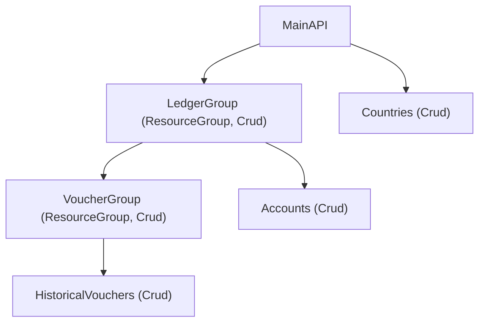

# End Goal: Enhanced Support for Nested API Resources in `crudclient`

The primary objective is to improve the `crudclient` framework to better support the definition and usage of APIs with deeply nested resources, such as those found in the `tripletex` SDK (e.g., `root/endpoint/subendpoint/action`).

This enhancement aims to solve two main problems for developers building SDKs on top of `crudclient`:

1.  **Improved Type Hinting and Autocompletion:** The current method of dynamically assigning nested resources directly on the main `API` class instance (e.g., `self.ledger.voucher = ...`) leads to poor static type analysis. This means IDEs and tools like MyPy struggle to infer types, hindering autocompletion and reducing the benefits of type checking. The goal is to enable full type support for these nested structures.
2.  **Better Code Organization and Scalability:** As the number of endpoints and nesting levels grows, the main `API` class can become cluttered and difficult to manage. The goal is to provide a more organized and hierarchical way to define these nested resources, making the SDK codebase cleaner, more maintainable, and easier to understand.

## Proposed Solution Outline

To achieve this, we will introduce a new architectural component, `ResourceGroup`. This component will allow developers to:

*   Group related CRUD resources under a common path segment.
*   **Handle CRUD operations for its own path segment directly** (e.g., `GET /ledger` if `LedgerGroup` has `_resource_path = "ledger"`).
*   Nest these groups within the main `API` class or within other `ResourceGroup` instances, creating a typed hierarchy that mirrors the API's structure.
*   Ensure that each `ResourceGroup` and the `Crud` resources registered within it are correctly typed, enabling robust static analysis and autocompletion.
*   Achieve this by having `ResourceGroup` **inherit from `Crud`** and extending the existing **class-based design philosophy** (similar to Django REST Framework) where configuration is primarily done through class variables. The new `ResourceGroup` will integrate seamlessly with the existing `API` and `Crud` patterns. While breaking changes are acceptable for this alpha-stage library, the core architectural style and class-based configuration approach **must be preserved and respected.**

**Note on Registration Method Convention:** Both the `API` base class and the new `ResourceGroup` base class will define separate abstract methods for registering direct operational endpoints (e.g., `_register_endpoints`, `_register_child_endpoints`) and for registering nested groups (e.g., `_register_groups`, `_register_child_groups`). This separation is a convention designed to enhance the organizational clarity and readability of SDKs built with `crudclient`, making it easier to distinguish between "leaf" operational resources and "branch" container groups within the API structure. These methods are called during the initialization of `API` or `ResourceGroup` instances.

### Conceptual Structure & Usage Example

The `ResourceGroup` itself now acts as a `Crud` instance for its own path, in addition to being a container.



### Illustrative Python Usage (Conceptual)

```python
# In crudclient/groups.py (or similar)
from typing import Optional, Type, Any, List, Union # Standard List from typing
from pydantic import BaseModel # Pydantic's BaseModel is used here as crudclient is designed for Pydantic models.

# Forward declarations or dummy classes for illustration
class ClientConfig: # Dummy ClientConfig
    pass

class Client:
    def __init__(self, config: ClientConfig): # Client typically takes a config object
        pass

class ApiResponse(BaseModel): # Illustrative base for API responses, often generic
    # Actual crudclient.models.ApiResponse might have fields like 'count', 'data', etc.
    pass

class Crud:
    _resource_path: str = ""
    # _datamodel is expected to be a Pydantic BaseModel subclass for data instances.
    _datamodel: Optional[Type[BaseModel]] = None
    # _api_response_model is for parsing the entire API response, often a generic wrapper.
    _api_response_model: Optional[Type[ApiResponse]] = None
    # Reflecting actual default from crudclient.crud.base.Crud
    allowed_actions: List[str] = ["create", "read", "list", "update", "destroy", "partial_update"]
    client: Client
    parent: Optional["Crud"]

    def __init__(self, client: Client, parent: Optional["Crud"] = None):
        self.client = client
        self.parent = parent

    # Dummy methods with more indicative return types
    def read(self, resource_id: Any, **kwargs: Any) -> Optional[BaseModel]:
        print(f"Reading {self._resource_path}/{resource_id}")
        # Actual implementation would parse response into self._datamodel or self._api_response_model
        return None
    def list(self, **kwargs: Any) -> Union[List[BaseModel], ApiResponse]: # Can return a list or a wrapped response
        print(f"Listing {self._resource_path}")
        # Actual implementation can return a list of self._datamodel instances
        # or an instance of self._api_response_model if defined (for pagination etc.)
        return []
    def create(self, data: dict, **kwargs: Any) -> Optional[BaseModel]:
        print(f"Creating in {self._resource_path}")
        return None
    def update(self, resource_id: Any, data: dict, **kwargs: Any) -> Optional[BaseModel]:
        print(f"Updating {self._resource_path}/{resource_id}")
        return None
    def destroy(self, resource_id: Any, **kwargs: Any) -> None:
        print(f"Destroying {self._resource_path}/{resource_id}")
        return None
    # Parameter 'method' matches actual crudclient.crud.operations.custom_action
    def custom_action(self, method: str, action_path: str, **kwargs: Any) -> Any:
        print(f"Custom action {method} on {self._resource_path}/{action_path}")
        return {}


class ResourceGroup(Crud): # ResourceGroup inherits from Crud
    # Class variables like _resource_path, _datamodel, allowed_actions are inherited from Crud.
    # Subclasses of ResourceGroup will define these for the group's own path operations.

    def __init__(self, client: Client, parent: Optional[Crud] = None):
        super().__init__(client, parent) # Initializes Crud capabilities for the ResourceGroup itself
        self._register_child_endpoints() # Call to register Crud resources under this group
        self._register_child_groups()    # Call to register nested ResourceGroups under this group

    def _register_child_endpoints(self) -> None:
        """Subclasses override to register child Crud resources.
           Example: self.some_child_crud = SomeChildCrud(self.client, parent=self)
        """
        pass

    def _register_child_groups(self) -> None:
        """Subclasses override to register nested ResourceGroups.
           Example: self.some_child_group = SomeChildGroup(self.client, parent=self)
        """
        pass

# In SDK (e.g., tripletex_sdk/api.py)
class AccountsCrud(Crud): _resource_path = "accounts"
class AccountingPeriodsCrud(Crud): _resource_path = "periods"
class HistoricalVouchersCrud(Crud): _resource_path = "historical"
class CountriesCrud(Crud): _resource_path = "countries"

# TripletexClient would inherit from crudclient.Client
class TripletexClient(Client):
    def __init__(self, config: ClientConfig): # Specific config for Tripletex
        super().__init__(config)

class LedgerModel(BaseModel): # Example Pydantic model for Ledger data
    name: str

class LedgerGroup(ResourceGroup):
    _resource_path = "ledger"
    _datamodel = LedgerModel
    allowed_actions = ["read"] # This group can only perform 'read' on "/ledger"

    def _register_child_endpoints(self):
        self.accounts = AccountsCrud(self.client, parent=self)
        self.periods = AccountingPeriodsCrud(self.client, parent=self)

    def _register_child_groups(self):
        self.voucher = VoucherGroup(self.client, parent=self)

    def open_post(self, **data: Any) -> Any: # Wrapper for a custom action
        return self.custom_action(method="POST", action_path="openPost", json=data)


class VoucherGroup(ResourceGroup):
    _resource_path = "voucher" # Path relative to parent group, e.g., "/ledger/voucher"
    allowed_actions = [] # This group has no direct CRUD operations on "/ledger/voucher"

    def _register_child_endpoints(self):
        self.historical = HistoricalVouchersCrud(self.client, parent=self)

# API class structure, aligning with crudclient.api.API
class API:
    client_class: Type[Client] # Must be set by API subclasses (e.g., TripletexClient)
    client: Client
    client_config: Optional[ClientConfig] # Config object for the client
    api_kwargs: dict # Stores other **kwargs passed to API.__init__

    def __init__(self, client: Optional[Client] = None, client_config: Optional[ClientConfig] = None, **kwargs: Any):
        self.client_config = client_config
        self.api_kwargs = kwargs

        if client:
            self.client = client # Use provided client instance
        else:
            # This block represents client initialization logic similar to API._initialize_client()
            if not hasattr(self, 'client_class') or not self.client_class:
                raise ValueError("API subclass must define client_class if client instance is not provided.")
            if not self.client_config:
                raise ValueError("client_config is required if client instance is not provided.")
            self.client = self.client_class(config=self.client_config)

        # Registration methods are called *after* self.client is ensured to be initialized.
        self._register_endpoints() # For top-level Crud resources
        self._register_groups()    # For top-level ResourceGroup instances

    def _register_endpoints(self) -> None:
        """Subclasses override to register top-level Crud resources.
           Example: self.countries = CountriesCrud(self.client, parent=None)
        """
        pass
    def _register_groups(self) -> None:
        """Subclasses override to register top-level ResourceGroup instances.
           Example: self.ledger = LedgerGroup(self.client, parent=None)
        """
        pass


class TripletexAPI(API):
    client_class = TripletexClient # Specifies the client type for this API

    def _register_endpoints(self):
        self.countries = CountriesCrud(self.client, parent=None) # parent=None for top-level

    def _register_groups(self):
        self.ledger = LedgerGroup(self.client, parent=None) # parent=None for top-level

# Example Usage:
# class MyTripletexConfig(ClientConfig): pass # Define actual config
# config = MyTripletexConfig()
# api = TripletexAPI(client_config=config)
# ledger_details = api.ledger.read(resource_id=123)
# opened_post = api.ledger.open_post(some_data="value")
# all_accounts = api.ledger.accounts.list()
```

The outcome should be a `crudclient` framework that empowers developers to build complex and deeply nested SDKs with greater clarity, type safety, and maintainability, while adhering to the established design principles of the library.

## Considerations for `ResourceGroup(Crud)` Implementation

When proceeding with the implementation of `ResourceGroup` inheriting from `Crud`, the following points should be carefully considered and evaluated:

1.  **Attribute Namespace Management & Method Conventions:**
    *   **Core Principle:** The design aims for a clear separation between standard RESTful operations and custom/extended actions, ensuring intuitive usage and minimizing namespace collisions.
    *   **Standard `Crud` Methods:** The base `Crud` class provides standard methods (`list`, `read`, `create`, `update`, `destroy`). These method names are reserved for their conventional operations on the resource's primary path (e.g., the `create()` method for a `POST` request to `/resource`). Their availability on an instance is governed by `allowed_actions` (as detailed in point #2).
    *   **`custom_action()` as the Workhorse:** The `self.custom_action(method, action_path, ...)` method is the fundamental mechanism for interacting with any non-standard endpoint or any operation not covered by the five standard methods. The `method` parameter here refers to the actual HTTP method string (e.g., "POST", "GET").
    *   **Developer-Defined Wrapper Methods for Custom Actions:**
        *   SDK developers will frequently define methods on their `Crud` or `ResourceGroup` subclasses that wrap `custom_action()` calls to provide a more convenient, type-safe interface for specific API actions (e.g., `def approve_invoice(self, invoice_id): return self.custom_action(method="POST", action_path=f"{invoice_id}/approve")`).
        *   **Naming Convention for Wrappers:**
            *   If a custom action conceptually mirrors a standard CRUD operation (e.g., an alternative endpoint for creating an entity, like `POST /resource/create_with_options`), the developer-defined wrapper method **must be named distinctively** (e.g., `create_with_options(...)`, not `create(...)`) to avoid overriding the standard `Crud` method.
            *   For custom actions that do not map to standard CRUD operations (e.g., `POST /resource/approve`), the wrapper method name should clearly reflect the action (e.g., `approve(...)`).
    *   **Potential for Declarative Custom Action Support (Future Consideration):**
        *   To further align with the "lots of functionality from little code" philosophy (akin to DRF), `crudclient` could evolve to simplify the creation of wrapper methods for common API patterns beyond the five standard CRUD operations. This would be achieved through **declarative syntax within `Crud`/`ResourceGroup` subclasses**, not through external schema discovery.
        *   **Examples of Declarable Patterns & Conventional Naming:**
            *   **Custom Actions on Resources:** For endpoints like `POST /resource/{id}/:action_name` or `GET /resource/:action_name` (e.g., `approve`, `reject`, `summary`). Developers might declare these actions (e.g., via a class variable like `resource_actions = {'approve': 'POST', 'get_summary': 'GET'}`) and the framework could assist in generating or validating corresponding methods like `resource.approve(...)` or `resource.get_summary(...)`.
            *   **Batch Operations:** For endpoints targeting a collection with a specific operation, often on a `/list` sub-path or similar, e.g., `POST /resource/list` (for batch creation), `DELETE /resource/list` (for batch destruction). These could be declared (e.g., `collection_actions = {'create_list': ('POST', 'list'), 'destroy_list': ('DELETE', 'list')}`) and conventionally map to methods like `resource.create_list(...)` or `resource.destroy_list(...)`.
        *   **Mechanism:** Future support would focus on declarative syntax within `Crud`/`ResourceGroup` subclasses, such as class variables listing custom actions, their corresponding `method` string (e.g., "POST", "GET"), and expected path segments. This allows the framework to provide helper utilities or even generate boilerplate for these declared actions.
        *   **Highly Specialized Path Segments:** For unique path structures (e.g., containing unconventional segments like the `>` character if not part of a framework-recognized pattern), these would generally remain the domain of manual `custom_action` wrappers by the SDK developer, unless `crudclient` introduces a specific declarative mechanism for them.
        *   **Naming Integrity:** Crucially, any such framework-assisted method generation based on declarations would need to enforce naming conventions that prevent clashes with the five standard `Crud` methods and with developer-defined attributes or methods.
    *   **Naming Conventions for Registered Child Resources/Groups:** Attribute names used to register child `Crud` instances or child `ResourceGroup` instances (e.g., `self.accounts = AccountsCrud(...)`) must not collide with any active standard `Crud` methods or any developer-defined/framework-generated action methods on the parent.
    *   **Mitigation of Collisions:**
        *   **Documentation:** Clearly document standard `Crud` methods and naming conventions.
        *   **Runtime Checks:** Consider runtime checks during child registration to warn or error on direct name collisions with active methods of the parent.

2.  **`allowed_actions` Behavior and Impact on Group Operations:**
    *   **Desired Behavior & Design Assumption:** For any `Crud` or `ResourceGroup` instance, methods corresponding to operations not listed in `allowed_actions` (e.g., "create", "read", "list", "update", "destroy") should ideally not appear as available. Accessing such a method (e.g., `api.ledger.list()` if `"list"` is not in `api.ledger.allowed_actions`) should ideally result in an `AttributeError`. This improves autocompletion, clearly signals unavailability, and is a core assumption for this `ResourceGroup` feature design.
    *   **Impact on "Empty" / Organizational Groups:** This behavior is key for `ResourceGroup` instances that are purely organizational or have limited direct operations. If a `ResourceGroup` subclass has an empty `allowed_actions` list, its inherited `Crud` methods for non-allowed operations will, per this assumption, be unavailable. `_datamodel` would likely be `None` for purely organizational groups.
    *   **Note on `Crud` Implementation Stability:** The precise mechanism by which the base `Crud` class achieves this `allowed_actions`-driven method availability is outside the immediate scope of the `ResourceGroup` feature. The stability of this design assumption for `ResourceGroup` depends on the eventual `Crud` implementation.
    *   The "conceptual heaviness" of `ResourceGroup` inheriting `Crud` methods is thus managed by the `allowed_actions` mechanism, ensuring only relevant operations are exposed.

3.  **Initialization and Parent Chaining:**
    *   **Clarity:** Ensure the `parent` argument in `__init__` methods is consistently typed (`Optional[Crud]`) and understood.
        *   For `ResourceGroup` or `Crud` instances nested under another `ResourceGroup`, their `parent` will be the containing `ResourceGroup` instance.
        *   For top-level `ResourceGroup` or `Crud` instances registered directly on the `API` class, their `parent` argument will be `None`. The `Crud` class's path construction logic must correctly handle `parent=None` by treating the resource's `_resource_path` as the root path segment (relative to the client's base URL).
    *   **Evaluation/Mitigation:** This is a standard OOP pattern. Type hints and clear internal logic in `_build_resource_path` (within `Crud`) are crucial for correct path assembly at all levels.

4.  **Type Hinting for `self` in Subclasses:**
    *   **Problem:** When SDK developers subclass `ResourceGroup` (e.g., `class LedgerGroup(ResourceGroup):`), they will assign child resources like `self.accounts: AccountsCrud = ...`. The type of `self.accounts` needs to be correctly inferred.
    *   **Evaluation/Mitigation:** Standard Python type hinting should handle this well. The attributes assigned in `_register_child_endpoints` and `_register_child_groups` will be typed based on the instances assigned.

5.  **`API` Class Structure for Registering Top-Level Items:**
    *   **Simplicity:** The `API` class will directly instantiate top-level `ResourceGroup` and `Crud` instances, passing `parent=None` to their constructors.
    *   **No Special Root Helper:** There is no need for a special `_api_root_path_helper` instance within the `API` class, as the `Crud` path logic is expected to correctly handle `parent=None` for root-level resources. This aligns with existing patterns where top-level resources are initialized without an explicit parent.
    *   **Registration Methods:** The `API` class will continue to use `_register_endpoints()` for top-level `Crud` resources and `_register_groups()` for top-level `ResourceGroup` instances.

By keeping these considerations in mind, we can build a robust and developer-friendly `ResourceGroup` feature.