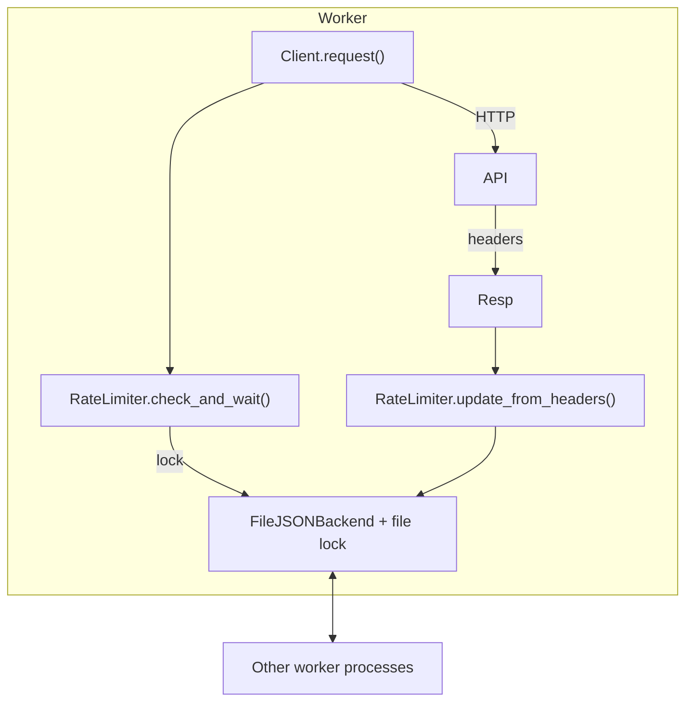

# CRUDClient Native Rate-Limiting – Draft Design
*Temporary working document – please review & edit.*

---

## 1  Background

* The Tripletex SDK (our largest downstream user) executes **500+** live integration tests in *true* parallel (`pytest -n 10`).
* Their previous file-based limiter still lets workers collide, producing many **HTTP 429** failures.
* We need a **cross-process** limiter that:
  * Understands Tripletex headers (`X-Rate-Limit-Remaining`, `X-Rate-Limit-Reset`)
  * Coordinates independent processes/cores (pytest-xdist, Celery, etc.)
  * Runs on Linux & macOS (CI)
  * Adds negligible overhead when not rate-limited
  * Is optional via feature-flag for other users.

---

## 2  MVP Goals (v0.1-exp)

| Priority | Goal | Notes |
|----------|------|-------|
| P0 | **Unblock Tripletex tests** – no 429s with `pytest -n 10` against live sandbox | Uses real credentials (env-vars listed below) |
| P0 | Sync **and** Async client support | Async = thin wrapper |
| P0 | Atomic cross-process coordination | File-lock JSON backend for MVP |
| P1 | Pluggable header-parsers | Tripletex default; others later |
| P1 | Config-flag gated | `config.enable_rate_limiter()` or env `CRUDCLIENT_RATE_LIMITER=on` |
| P2 | Storage abstraction layer | Future Redis / shared-mem backends |

---

## 3  Key Environment Variables for Live Integration Tests

```
TRIPLETEX_TEST_CONSUMER_TOKEN
TRIPLETEX_TEST_EMPLOYEE_TOKEN
TRIPLETEX_CONSUMER_TOKEN
TRIPLETEX_EMPLOYEE_TOKEN
```

Tests will be skipped if these are absent.

---

## 4  High-Level Architecture



### Components

| Layer | Responsibility |
|-------|----------------|
| RateLimiter Facade | Public API (`check_and_wait`, `update_from_headers`) |
| Header Parser | Extract `(remaining, seconds_until_reset)` |
| State Backend | Atomic read/write; **FileJSONBackend** for MVP |
| Async Adapter | Same semantics with `asyncio.sleep` |

Directory sketch

```
crudclient/ratelimit/
    __init__.py
    facade.py           # sync
    facade_async.py     # async
    storage/file_json.py
    parsing/tripletex.py
tests/
    unit/ratelimit_parallel_test.py
    integration/test_tripletex_rate_limit_live.py
docs/rate_limiting_design_draft.md   <- this file
```

---

## 5  Concurrency & Atomicity

* Lock file via `fcntl.flock` (POSIX) or `msvcrt.locking` (Win).
* State path: `~/.cache/crudclient/rl_{host_hash}.json` (configurable).
* JSON payload:

```json
{"remaining": 97, "reset_ts": 1717123456.327}
```

* Writes are followed by `fsync`; corruption resets to “unknown”.

---

## 6  Threshold Logic

```
dynamic_threshold = detected_workers + buffer
if remaining != unknown and remaining <= dynamic_threshold:
    sleep(reset_ts - now + 1)
else:
    decrement remaining
```

* `detected_workers`
  * Prefer `int(os.environ.get("PYTEST_XDIST_WORKER_COUNT", 1))`
  * Fallback `multiprocessing.cpu_count()`
* Default `buffer = 10`

---

## 7  Testing Strategy – **TDD First**

### 7.1  Atomic Parallel Unit Test

* Spawn `multiprocessing.Process` (N=8) with temp backend file.
* Each process loops `.check_and_wait()` until overall limit exhausted.
* Assert total successful calls == limit and no 429 simulation.

### 7.2  Live Tripletex Integration Test

* `@pytest.mark.tripletex_live`
* Requires the four env-vars above.
* Run with `pytest -n 10`.
* **Endpoint**: `GET /v2/country?count=1` – extremely cheap, avoids quasi-stateful objects.
* Issue 120 requests in parallel (Tripletex limit = 100).
* Expect:
  * Total runtime ≈ reset window.
  * **No HTTP 429 raised**.

### 7.3  CI Matrix

| Job | OS | Python | Focus |
|-----|----|--------|-------|
| unit-rl | ubuntu | 3.10-3.12 | coverage |
| rl-parallel | ubuntu & macos | 3.11 | atomic test |
| tripletex-live (nightly) | ubuntu | 3.11 | needs secrets |

---

## 8  Public API Sketch

```python
from crudclient import Client
from crudclient.ratelimit import enable_rate_limiter  # helper

client = Client(config=TripletexConfig(...))
enable_rate_limiter(client, buffer=10)
```

or via config builder:

```python
cfg = TripletexConfig(...).enable_rate_limiter(buffer=10)
client = Client(config=cfg)
```

---

## 9  Open Questions

1. Is `$XDG_CACHE_HOME` the right default for state files?
2. Should MVP also parse `Retry-After`?
3. Add jitter to avoid thundering-herd on window open?

---

### Next Steps

1. **Review / edit this draft** (collaborative).
2. Green-light → switch to Code mode, scaffold rate-limiter package.
3. Write failing atomic & live tests, then implement until green.
---

## 10  Deeper Investigation & Decisions

### 10.1  Where to Hook in **crudclient**

1. **`crudclient/http/client.py`**
   * All synchronous requests funnel through `HttpClient._request()` ([`crudclient/http/client.py:200-300`](crudclient/http/client.py:200)).
   * We will import `crudclient.ratelimit.get_rate_limiter(config)` at module top; the return may be `None` when disabled.
   * Insert two touch-points:
     ```python
     self._rate_limiter.check_and_wait()             # BEFORE session.request(...)
     ...
     self._rate_limiter.update_from_headers(resp.headers)  # AFTER response / finally
     ```
   * Error path already raises `RateLimitError` (mapped from 429); we’ll still call `update_from_headers(e.response.headers)` in the except-block.

2. **Async extension**
   * There is no async `HttpClient` yet.  We will scope MVP to sync; async facade is planned but gated behind TODO flag.

### 10.2  File-locking Library Choice

| Option | Pros | Cons |
|--------|------|------|
| **Custom `fcntl`/`msvcrt` (current Tripletex impl)** | Zero deps, predictable | Windows edge cases, verbose |
| `filelock` PyPI | Battle-tested, cross-platform | Pure-Python (uses `fcntl`/`msvcrt` anyway); adds dep |
| **`portalocker`** PyPI | C-extension for speed; handles NFS | Extra compile step on Macs/Win |
| `fasteners` Google | Extras for semaphore; gRPC uses it | Heavy; unmaintained lately |

**Decision**: adopt `portalocker>=2.8` (MIT).  Reasons:
* Handles Windows & Unix with identical API.
* Supports *timeout* and *non-blocking* acquisition; useful for future non-sleep polling strategies.
* Wheel distribution available for CPython 3.10-3.12 → no compile pain.

Fallback: if import fails, switch to minimal internal lock (logs warning).

### 10.3  Helper Libraries

* **`appdirs`** for cache directory discovery (already indirect dep via black).
* **`typing_extensions`** for `ParamSpec` helpers – already in tree.

### 10.4  Dependency Footprint (sizes)

| Package        | Wheel Size (Py311 manylinux) | Purpose                                              | Placement |
|----------------|-----------------------------|------------------------------------------------------|-----------|
| portalocker 2.8 | **≈ 32 KB**                | Reliable cross-platform file locking                 | prod      |
| appdirs 1.4     | **≈ 14 KB**                | OS-correct cache-directory discovery                 | prod      |

Total additional download ≈ 46 KB – negligible.

Add to `pyproject.toml`:

```toml
[tool.poetry.dependencies]
portalocker = "^2.8"
appdirs = "^1.4"
```

---

### 10.5  SQLite Backend – Feasibility Snapshot

Python ships with `sqlite3`, offering an embedded, ACID-compliant store.
Replacing the JSON+lock file with a single-table SQLite DB could improve consistency—but it comes with trade-offs.

| Aspect                | SQLite Backend                                            | JSON + File Lock (current)                   |
|-----------------------|-----------------------------------------------------------|----------------------------------------------|
| **Atomicity**         | Built-in transactions; `BEGIN IMMEDIATE` locks database.  | Manual lock + atomic file replace.           |
| **Crash Safety**      | WAL mode survives power loss; no partial JSON writes.     | Possible zero-byte corruption (mitigated).   |
| **Portability**       | `sqlite3` stdlib, no extra deps.                          | Pure stdlib + tiny portalocker.              |
| **Concurrent Writers**| Still *serialised*: first writer holds DB lock—other procs block. Equivalent to file lock. | Same behaviour.                              |
| **Lock Granularity**  | Entire DB file; identical to our coarse lock.            | Entire state file.                           |
| **Complexity**        | Requires SQL setup + migration path.                      | Simpler read/update helpers.                 |
| **Debug Visibility**  | Human-readable via `sqlite3` CLI.                         | Human-readable JSON.                         |
| **Filesystem Issues** | Network FS (NFS, SMB) needs WAL disabled; risk of busy-file errors. | portalocker handles NFS reasonably.          |
| **State Size**        | Few KB; minimal.                                          | Few bytes.                                   |

**Verdict**: JSON+portalocker already satisfies our requirements with minimal moving parts and tiny deps.
SQLite adds negligible benefit while introducing WAL/NFS edge-cases and SQL boilerplate.
We can revisit if future features demand richer schemas (e.g., per-endpoint metrics). For now we stick to the file-JSON backend and keep a placeholder interface allowing future `SQLiteBackend`.

---
No other runtime deps.

### 10.4  Edge-Case Scenarios

| Scenario | Behaviour |
|----------|-----------|
| Reset ts already elapsed when worker reads state | Treat as unknown; proceed & overwrite |
| Remaining negative | Clamp to 0; force sleep |
| Clock drift between workers | File backend uses **monotonic** timestamp for comparisons; OK |
| Backend JSON corrupted | Catch `json.JSONDecodeError` → reset to unknown and log at WARNING |
| Fork after acquiring lock | child closes FD on first access, re-opens; test in unit suite |

### 10.5  Worker Detection Logic

```python
# priority 1: explicit env
workers = int(os.getenv("CRUDCLIENT_WORKERS", 0))
# priority 2: Celery autoscale hint
if not workers and os.getenv("CELERY_CONCURRENCY"):
    workers = int(os.getenv("CELERY_CONCURRENCY"))
# fallback
if not workers:
    workers = os.cpu_count() or 1
```

Buffer defaults to `max(4, workers // 2)`; configurable via `CRUDCLIENT_RL_BUFFER`.

### 10.6  Live-Test Design Details

* Use **Tripletex test tokens** only (`TRIPLETEX_TEST_*`).
* Endpoint: `/v2/company/{id}` (a cheap GET).
* Test logic:
  ```python
  from concurrent.futures import ThreadPoolExecutor
  with ThreadPoolExecutor(max_workers=10) as ex:
      futures = [ex.submit(client.company.get, companyId) for _ in range(120)]
      for f in futures: assert f.result().status_code == 200
  ```
* Mark `@pytest.mark.tripletex_live` and skip when tokens missing.

### 10.7  Dependency Footprint

Add to `pyproject.toml`:

```toml
[tool.poetry.dependencies]
portalocker = "^2.8"
appdirs = "^1.4"  # if not already
```

---
---

## 11  Why the Existing Tripletex Prototype Fails & How the New Design Solves It

| Failure in Tripletex File-Limiter | Root Cause | Corresponding Fix in Our Design |
|----------------------------------|------------|---------------------------------|
| **Reset not persisted** – when `now >= reset_ts` they set `remaining = default_remaining` **but never write the new state** (`_write_state` is skipped).  Other workers keep reading stale `remaining` ≤ threshold and all fire requests → **429 storm**. | Logic bug. | In `check_and_wait` we **always persist** any state mutation, including reset events: `self._write_state(unknown, 0.0)` before dropping the lock. |
| **Update path too conservative** – `update_from_headers()` only overwrites state if new `reset_ts` `>` old, or same `reset_ts` with *lower* `remaining`.  When the *first* worker after reset receives headers (`remaining == limit`), comparison fails and state never refreshed; workers assume “unknown” and collide. | Comparison predicate misses “higher remaining after later reset”. | Our header parser resets state whenever `reset_ts` **changes in either direction** (≠) OR window clearly restarted (`remaining == limit`). |
| **Lock scope leak** – During long sleep they `release_lock()` but **never write back** incremented `remaining` first; another worker may acquire lock, see stale state and decrement to negative values. | Missing pre-sleep commit. | We commit decrement **before** releasing the lock and sleeping; the sleeping thread holds no stale in-mem state. |
| **Manual fcntl vs Windows quirks** – custom unlock logic sometimes throws (comment: _“ignoring Windows unlock error”_).  CI may swallow exceptions, leaving file locked. | Platform edge cases. | We adopt **`portalocker`**, which handles cross-platform edge cases and NFS.  Wheel binaries avoid compile woes. |
| **No atomic write** – JSON written with `open(..., "w")` then `json.dump` – if process crashes mid-write the file is 0-bytes → subsequent `json.load` fails in all workers. | Partial writes. | Backend uses `portalocker.Lock(..., mode="wb", fail_when_locked=False)` and **writes to tmp file then `os.replace`** for atomicity.  Corruption fallback resets to “unknown” and logs error. |
| **Dynamic threshold mis-estimation** – They pass `num_workers + buffer` from first worker’s constructor; under pytest-xdist each worker sees **`num_workers=1`** unless the user injects the count manually → threshold far too low. | Per-worker config ignorance. | Our detection hierarchy (`CRUDCLIENT_WORKERS`, `PYTEST_XDIST_WORKER_COUNT`, etc.) evaluates **inside each check**, ensuring consistent view even if workers launched independently. |
| **Missing concurrency tests** – Prototype never exercised under multi-proc unit tests, so race bugs persisted. | Lack of safety net. | We add **atomic parallel test** (section 7.1) that spawns 8 real processes and asserts call count + state integrity on every CI run. |

### Net Effect

The combination of guaranteed state persistence, atomic replace-writes, robust lock library, and accurate worker threshold means every request path follows:

1. **Acquire lock → read state → decide**
2. If window elapsed → reset persisted → continue loop.
3. If allowed → decrement persisted → release lock quickly.
4. If waiting → compute sleep_time → release lock **after** persisting state → sleep.
5. On every response, **update_from_headers** refreshes state for all peers.

This eliminates the stale-state & race conditions that plagued the Tripletex attempt.