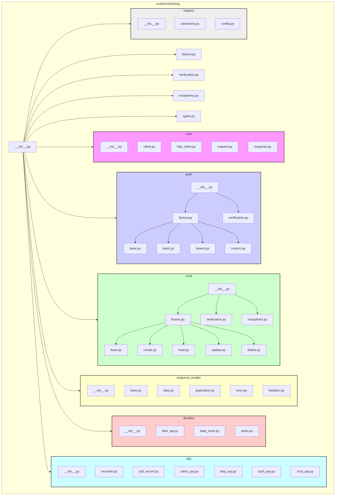

# Design Plan: `crudclient/testing/` Module

## 1. Purpose and Scope

*   **Purpose:** To provide a comprehensive and configurable set of test doubles (mocks, stubs, fakes, spies) for the `crudclient` library components (`Client`, `API`, `CRUD`, `Auth`, `HTTPClient`). This enables isolated unit testing of application code that uses `crudclient` without making actual network requests or relying on external services.
*   **Audience:** Primarily for internal testing of the `crudclient` library, but designed and packaged to be optionally available for use by downstream consumers of the library.
*   **Scope:**
    *   Mocking the core `crudclient.Client` interface and its interactions.
    *   Mocking `crudclient.API` endpoint definitions and behaviors.
    *   Mocking `crudclient.crud` operations (Create, Read, Update, Delete) with configurable responses and error conditions.
    *   Mocking various `crudclient.auth` strategies.
    *   Simulating HTTP request/response cycles, including errors, pagination, rate limiting, etc.
    *   Providing utilities for configuring mock behavior (e.g., defining expected requests and responses).
    *   Providing verification tools (spies, assertions) to check how the client was used during tests.
    *   Adhering to a guideline of keeping individual Python files under 300 lines of code (LoC) to enhance readability and maintainability.

## 2. Location and Packaging

*   **Location:** The framework will reside within the main package source at `crudclient/testing/`.
*   **Packaging:**
    *   The framework's Python code files will be included in the standard package distribution (wheels/sdists).
    *   Any external dependencies required *only* by the testing framework will be managed via an optional extra, installable with `pip install crudclient[testing]`. The `[project.optional-dependencies]` section in `pyproject.toml` will define the `testing` extra.
    *   Consumers installing only `crudclient` will receive the testing code files but not any testing-specific dependencies.

## 3. Key Functionalities (Derived from Phase 2 Requirements)

*   **Mock Client Core:** Enhanced, configurable mock of `crudclient.Client`.
*   **Mock API Factory:** Enhanced factory for creating mock `crudclient.API` instances with pre-configured operations and realistic responses.
*   **Mock CRUD Factories:** Enhanced factories for mocking specific CRUD operations (`create`, `read`, `update`, `delete`) with complex response/error simulation.
*   **Mock Auth Factories:** Enhanced factories for mocking all `crudclient.auth` strategies (success/failure scenarios).
*   **Response Simulation:** Utilities for building realistic responses (data, headers, status codes, pagination, errors).
*   **Request/Interaction Verification:** Sophisticated spies and assertion helpers to verify client, API, CRUD, and auth usage patterns.
*   **Advanced Test Doubles:**
    *   `FakeAPI`: A more realistic fake with an in-memory data store simulating backend state.
    *   Comprehensive Stubs: Implementations for key interfaces.
    *   Detailed Spies: Implementations focused on recording interactions for verification.
*   **Configuration:** Mechanisms to easily configure mock behavior per test (e.g., expected responses for specific requests).

## 4. Proposed Module Structure & File Organization



## 5. File Specifications (Detailed Steps)

*   **`crudclient/testing/` (Top Level)**
    *   `__init__.py`: Exports key public-facing components (e.g., `MockClient`, `MockAPI`, `MockClientFactory`, `FakeAPI`, assertion helpers) for easy import by consumers and internal tests.
    *   `factory.py`: Defines `MockClientFactory` to create configured `MockClient` instances. This factory will likely compose or utilize factories from submodules (`auth.factory`, `crud.factory`).
    *   `verification.py`: Contains high-level verification functions/classes that might coordinate verification across different spies (client, auth, crud). Potentially less critical if `helpers/assertions.py` provides the main user interface.
    *   `exceptions.py`: Defines custom exceptions specific to the mock client framework (e.g., `MockConfigurationError`, `VerificationError`).
    *   `types.py`: Contains shared type hints, protocols (e.g., `Mockable`), and data structures used across the testing modules.

*   **`crudclient/testing/core/`**: Mocks for fundamental client and HTTP components.
    *   `__init__.py`: Exports core mock components like `MockClient`, `MockHTTPClient`.
    *   `client.py`: Defines the main `MockClient` class, mimicking `crudclient.Client`. Responsible for routing requests to appropriate mock handlers (auth, crud, http) based on configuration and API structure.
    *   `http_client.py`: Defines `MockHTTPClient`, mimicking `crudclient.http.Client`. Simulates HTTP requests/responses based on configuration (e.g., matching URL/method to predefined responses). Handles low-level details like status codes, headers, basic error simulation.
    *   `request.py`: Defines `MockRequest` or utilities for matching incoming requests against configured expectations (URL, method, headers, body).
    *   `response.py`: Defines `MockResponse` or utilities related to representing and configuring simulated responses.

*   **`crudclient/testing/auth/`**: Mocks specific to authentication.
    *   `__init__.py`: Exports the `MockAuthFactory` and potentially auth-specific verification tools.
    *   `factory.py`: Defines `MockAuthFactory` to create mock instances of different auth strategies (`MockBasicAuth`, `MockBearerAuth`, etc.).
    *   `base.py`, `basic.py`, `bearer.py`, `custom.py`: Implementations of the mock auth strategies (`MockAuthStrategy` subclasses). They handle simulation logic (e.g., adding expected headers, checking mock credentials) and interaction with `MockHTTPClient` or `MockRequest`.
    *   `verification.py`: Contains auth-specific verification helpers (e.g., `assert_auth_used`, `get_auth_calls`) that likely interact with the `spy` module.

*   **`crudclient/testing/crud/`**: Mocks specific to CRUD operations.
    *   `__init__.py`: Exports the `MockCRUDFactory` and potentially CRUD-specific verification tools.
    *   `factory.py`: Defines `MockCRUDFactory` to create mock instances of CRUD operations, potentially configured per-resource.
    *   `base.py`, `create.py`, `read.py`, `update.py`, `delete.py`: Implementations of mock CRUD operations (`MockCRUDOperation` subclasses). Handle request matching for specific CRUD actions, response generation (using `response_builder`), and error simulation based on configuration.
    *   `verification.py`: Contains CRUD-specific verification helpers (e.g., `assert_create_called_with`, `get_read_calls`) interacting with the `spy` module.
    *   `exceptions.py`: Defines mock exceptions related to CRUD operations (e.g., simulating `ResourceNotFound`, `ValidationError` during mock operations).

*   **`crudclient/testing/response_builder/`**: Utilities for constructing mock responses.
    *   `__init__.py`: Exports key builder functions or classes.
    *   `base.py`: Base class or core functions for building `MockResponse` objects.
    *   `data.py`: Helpers for generating mock data payloads (JSON, etc.), potentially integrating with libraries like `faker` if added as an optional dependency.
    *   `pagination.py`: Helpers for simulating paginated responses according to different strategies (e.g., Link headers, offset/limit).
    *   `error.py`: Helpers for constructing standard error responses (e.g., 404 Not Found, 400 Bad Request, 500 Server Error) with customizable details.
    *   `headers.py`: Helpers for adding common or custom headers to mock responses.

*   **`crudclient/testing/doubles/`**: More sophisticated test doubles.
    *   `__init__.py`: Exports `FakeAPI`, `InMemoryDataStore`, and potentially common stubs.
    *   `fake_api.py`: Defines the `FakeAPI` class. Implements API logic in memory, using `InMemoryDataStore`. Interacts with or replaces parts of `MockHTTPClient` / `MockCRUDOperation` to provide stateful responses based on data store contents.
    *   `data_store.py`: Defines `InMemoryDataStore` class (or similar). Provides methods to manage state (create, read, update, delete data in memory, mimicking a simple backend). Used by `FakeAPI`.
    *   `stubs.py`: Contains pre-configured, minimal implementations (stubs) of client/API/CRUD components for specific common scenarios (e.g., `StubAuthFailureClient`, `StubRateLimitedClient`).

*   **`crudclient/testing/spy/`**: Components focused on recording interactions.
    *   `__init__.py`: Exports spy components and the main recorder/query interface.
    *   `recorder.py`: Defines `InteractionRecorder` class (likely a singleton or context-managed instance) as a central store for recorded `CallRecord` instances. Provides methods to add records and query them.
    *   `call_record.py`: Defines `CallRecord` class/dataclass to store details of a single interaction (target object/method, args, kwargs, timestamp, potentially return value/exception).
    *   `client_spy.py`, `http_spy.py`, `auth_spy.py`, `crud_spy.py`: Spy implementations (e.g., `SpyHttpClient`). These wrap or inherit from the corresponding mock components (`MockHttpClient`). When a method is called, they first record the call details using `InteractionRecorder` and then delegate to the underlying mock's implementation.

*   **`crudclient/testing/helpers/`**: General utility functions and classes.
    *   `__init__.py`: Exports assertion helpers and configuration helpers.
    *   `assertions.py`: Defines custom assertion functions providing a user-friendly interface to the `spy` module's data (e.g., `assert_called_once_with`, `assert_no_calls`, `assert_call_count`). These query the `InteractionRecorder`.
    *   `config.py`: Contains helper functions or classes to simplify the configuration of mocks for common scenarios (e.g., `configure_success_response(mock_client, path, data)`, `configure_error_response(mock_client, path, status_code)`).

## 6. Interfaces and Composition

*   **Client -> HTTP/Auth/CRUD:** `MockClient` delegates requests: Auth (`MockAuthStrategy`) -> CRUD (`MockCRUDOperation`) -> HTTP (`MockHTTPClient` or `FakeAPI`).
*   **Configuration:** Tests interact with `MockClientFactory` and `helpers/config.py` to set up mock behavior.
*   **Response Building:** `MockCRUDOperation` uses `response_builder` to construct `MockResponse`.
*   **Spying:** Spy components wrap mocks, record calls via `InteractionRecorder`, then delegate.
*   **Verification:** `helpers/assertions.py` queries `InteractionRecorder` to verify calls made through spies.
*   **FakeAPI:** Can replace `MockHTTPClient` or `MockCRUDOperation` handlers, using `InMemoryDataStore` for stateful responses.

## 7. <300 LoC Guideline

The modular structure with separation of concerns into distinct submodules and files per operation/strategy facilitates adherence to this guideline.

## 8. Documentation (`crudclient/testing/README.md`)

```markdown
# crudclient Testing Utilities (`crudclient.testing`)

## Purpose

This module provides a framework for creating test doubles (mocks, stubs, fakes, spies) for the `crudclient` library. It allows developers to write isolated unit tests for code that interacts with `crudclient` components (`Client`, `API`, `CRUD`, `Auth`, `HTTPClient`) without making real network calls.

## Installation

These utilities are included with the `crudclient` package but might have optional dependencies. To ensure all necessary dependencies for testing are installed, use the `[testing]` extra:

```bash
pip install crudclient[testing]
```

## Intention

The primary goal is to provide a flexible, configurable, and maintainable way to simulate `crudclient` behavior in tests. This includes:

*   Simulating successful responses for various operations.
*   Simulating error conditions (HTTP errors, API errors).
*   Simulating complex scenarios like pagination and rate limiting.
*   Verifying that the code under test interacts with the client as expected.
*   Providing realistic fakes (like `FakeAPI`) for stateful interaction testing.

## Organization

The framework is organized into the following submodules:

*   **`core/`**: Mocks for the fundamental `Client` and `HTTPClient`.
*   **`auth/`**: Mocks and factories for different authentication strategies.
*   **`crud/`**: Mocks and factories for CRUD operations (Create, Read, Update, Delete).
*   **`response_builder/`**: Utilities to construct various mock HTTP responses.
*   **`doubles/`**: Advanced test doubles, including `FakeAPI` with an in-memory data store and specialized stubs.
*   **`spy/`**: Components for recording interactions (method calls) with mock objects for later verification.
*   **`helpers/`**: Assertion helpers and configuration utilities to simplify test writing.
*   **`factory.py`**: Central factory (`MockClientFactory`) for creating configured `MockClient` instances.
*   **`verification.py`**: High-level verification utilities.
*   **`exceptions.py`**: Custom exceptions for the mocking framework.
*   **`types.py`**: Shared type definitions.

*(Further usage examples and configuration details will be added here as the framework is implemented)*

## Contribution Guidelines

*   Keep individual Python files focused on a single responsibility.
*   Aim to keep files under 300 lines of code (LoC).
*   Ensure new mocks or features are accompanied by unit tests (within the main `tests/unit/testing/` directory).
*   Update this README and add docstrings for new public-facing components.